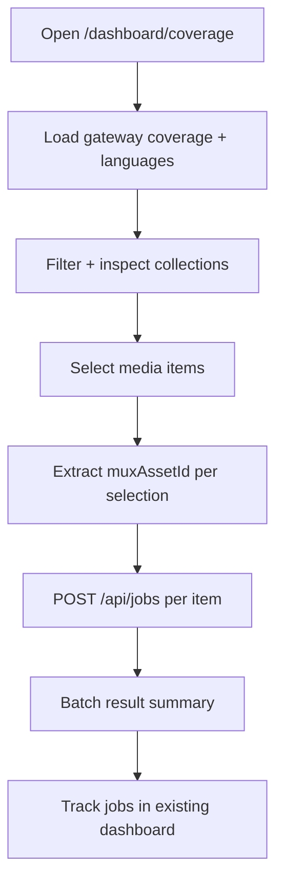

# feat: Migrate legacy coverage reporting and order flow into current app

## Enhancement Summary
**Deepened on:** 2026-02-15  
**Sections enhanced:** 11  
**Research inputs used:** local skills (`architecture-strategist`, `security-sentinel`, `performance-oracle`, `julik-frontend-races-reviewer`, `kieran-typescript-reviewer`, `code-simplicity-reviewer`, `pattern-recognition-specialist`), institutional learnings in `/videoforge/docs/solutions/`, and official framework docs via Context7 (`/vercel/next.js`, `/websites/react_dev`).

### Key Improvements
1. Added concrete data freshness and caching rules for Next.js App Router route handlers and page fetches.
2. Added explicit async race prevention and duplicate-submit controls for batch job creation UX.
3. Added a deterministic test matrix for gateway failures, partial mapping, mixed batch outcomes, and regression protection.

### New Considerations Discovered
- Next.js 15 route-handler `GET` is not cached by default, but dynamic behavior must still be explicit for maintainability and operator clarity.
- React async UI flows need cleanup/cancellation patterns to avoid stale updates and unstable selection/submit states.

## Overview
Migrate the legacy frontend experience from `/videoforge/old-app-code/ai-media` into the current single-app Next.js platform by adding:
- coverage reporting visualization
- language and content selection UX
- selection-driven ordering flow that creates enrichment jobs

The migration is additive and must not regress existing dashboard/API/workflow behavior. Current engineering principles and contracts remain authoritative.

## Problem Statement / Motivation
The current app is strong on workflow orchestration and job observability, but it lacks the richer operator UX from the previous app generation (coverage report, geo/language selection, batch ordering from report selections). We need to port those missing capabilities without importing legacy monorepo assumptions, global CSS collisions, or architectural drift.

## Research Summary

### Found Brainstorm Context
Using brainstorm: `/videoforge/docs/brainstorms/2026-02-15-legacy-frontend-migration-brainstorm.md`.

Confirmed decisions from brainstorm:
- route-isolated migration under current app
- gateway-first external data source (`NEXT_PUBLIC_GATEWAY_URL`, fallback `NEXT_STAGE_GATEWAY_URL`)
- `muxAssetId` derived from selected media items
- multi-select submit creates one job per selected media item immediately

### Repository Patterns (Local)
- Single-app + deterministic constraints are explicit in `/videoforge/AGENTS.md:11`, `/videoforge/AGENTS.md:12`, `/videoforge/AGENTS.md:13`, `/videoforge/AGENTS.md:63`, `/videoforge/AGENTS.md:102`.
- Current job contract is strict and typed in `/videoforge/src/app/api/jobs/route.ts:8` and `/videoforge/src/app/api/jobs/route.ts:68`.
- Current dashboard/new-job UX patterns exist in `/videoforge/src/app/dashboard/jobs/page.tsx:17` and `/videoforge/src/app/dashboard/jobs/new-job-form.tsx:15`.
- Runtime/env configuration pattern is centralized in `/videoforge/src/config/env.ts:13`.
- Codex-Cloud-safe in-process tests already exist and should be extended, not replaced:
  - `/videoforge/tests/api-jobs-contract.test.ts:5`
  - `/videoforge/tests/api-smoke.test.ts:23`
  - `/videoforge/tests/dashboard-jobs-page.test.tsx:6`

### Institutional Learnings (docs/solutions)
- Preserve deterministic state/error behavior and avoid silent state corruption:
  - `/videoforge/docs/solutions/logic-errors/pending-jobs-and-lost-step-context-video-enrichment-workflow-20260214.md:38`
  - `/videoforge/docs/solutions/logic-errors/pending-jobs-and-lost-step-context-video-enrichment-workflow-20260214.md:72`
- Keep integration failures explicit/structured at adapter boundaries; avoid silent fallback:
  - `/videoforge/docs/solutions/architecture/mux-ai-compatibility-gate-and-fallback-20260214.md:23`
  - `/videoforge/docs/solutions/architecture/mux-ai-compatibility-gate-and-fallback-20260214.md:30`

### Skill-Based Review Highlights
- Architecture strategy: keep coverage logic in bounded feature modules and keep gateway access behind adapters/route handlers.
- Security review: validate query params and request bodies at every new coverage API route; never trust gateway payload shape.
- Performance review: avoid rendering full unbounded media lists at once; use deterministic pagination/chunk loading and avoid O(n²) selection operations.
- Frontend race review: prevent duplicate submits, cancel stale async language/media fetches, and guard state transitions during unmount/re-render.
- TypeScript quality review: use explicit DTO types and discriminated unions for selectable vs non-selectable media items; do not use `any`.
- Simplicity review: avoid introducing speculative abstractions (queues, orchestration layers) for batch submit; keep one clear submit pipeline.
- Pattern consistency review: follow existing route-handler patterns, `env` access conventions, and in-process test style.

### External Documentation Insights (Context7)
- Next.js App Router guidance confirms dynamic data should use explicit `cache: 'no-store'` (or route-level dynamic config) for request-time freshness.
- Next.js v15 docs note route-handler `GET` caching behavior changes and reinforce explicit cache intent for clarity.
- React 19 guidance supports pending-state management (`useTransition` / form pending states) and cleanup patterns to avoid stale async updates.
- Official references:
  - https://github.com/vercel/next.js/blob/v15.1.11/docs/01-app/02-building-your-application/01-routing/13-route-handlers.mdx
  - https://github.com/vercel/next.js/blob/v15.1.11/docs/01-app/03-api-reference/03-file-conventions/route-segment-config.mdx
  - https://react.dev/blog/2024/04/25/react-19
  - https://react.dev/learn/synchronizing-with-effects

### External Research Decision
External research completed in a constrained form using official framework sources (Next.js and React docs) to harden caching, async-state, and race-condition guidance.
Reason: this migration introduces new dynamic route handlers and async selection/submission UX that benefit from framework-level correctness patterns.

## SpecFlow Analysis

### User Flow Overview
1. Operator opens coverage route.
2. App fetches language and media coverage data from gateway (`NEXT_PUBLIC_GATEWAY_URL` or `NEXT_STAGE_GATEWAY_URL`).
3. Operator filters by report type, geo/language, and coverage status.
4. Operator selects media items for translation/order.
5. Submit triggers one `POST /api/jobs` per selected item using extracted `muxAssetId`.
6. UI returns batch summary (created/failed/skipped) and deep-links to created jobs.
7. Operator validates progress on existing `/dashboard/jobs` and `/dashboard/jobs/[id]`.



### Flow Permutations Matrix
- Entry points: direct route load, refresh with query params, empty selection state.
- User intent: explore-only mode vs select-and-submit mode.
- Data availability: gateway configured, gateway missing, gateway returns partial records.
- Submission outcomes: all success, mixed success/failure, all failure.
- Scale: small selection (1-5) vs large selection (batch with throttling/guardrails).

### Missing Elements & Gaps To Resolve in Implementation
- Ensure gateway payload includes or can deterministically resolve `muxAssetId` for each selectable media item.
- Define submission behavior for selected items missing `muxAssetId` (must be excluded with actionable reason, not silently dropped).
- Define idempotency/duplicate-click handling for batch submit in client UX.
- Define deterministic ordering for batch requests and summary output.
- Define pagination/virtualization strategy for large coverage datasets to avoid UI lockups.
- Define fallback UX when gateway env vars are absent in local/prod.
- Use deterministic sequential submission for initial implementation; defer bounded parallelism unless benchmarks require it.
- Define abort behavior when user changes language/filter during in-flight gateway fetches.

### Critical Clarifications (Resolved for Planning)
- Multi-select submission behavior: create one job per selected media item immediately.
- Batch result ordering: preserve original selected-item order in summary output, regardless of request completion order.
- Batch concurrency strategy: set initial implementation to sequential for deterministic behavior and simpler failure reporting; revisit bounded parallelism only if needed.

## Proposed Solution
Implement a bounded `coverage` feature module in the current app that ports legacy UX patterns while adapting data and submission logic to current service/API contracts.

Core rules:
- do not change core job API shape
- do not import old monorepo dependencies
- keep external API calls behind adapters/route handlers
- keep styling scoped to avoid global regressions

## Technical Approach

### Phase 1: Feature Foundation and Route Isolation
- [x] Add new route and page shell for coverage experience (`/videoforge/src/app/dashboard/coverage/page.tsx`).
- [x] Add navigation link from layout while preserving current jobs routes (`/videoforge/src/app/layout.tsx`).
- [x] Create feature module namespace (`/videoforge/src/features/coverage/`).
- [x] Add feature-level types for coverage collections, statuses, and selection payloads.

Deliverables:
- isolated route with no behavioral change to `/dashboard/jobs`
- clear feature boundary for subsequent migration phases

Research insights:
- Maintain architectural separation by splitting into:
  - `feature UI` (`src/features/coverage/*`)
  - `gateway adapter` (`src/services/coverage-gateway.ts`)
  - `route handlers` (`src/app/api/coverage/*`)
- Define typed contracts early to avoid migration drift:
  - `CoverageCollection`
  - `CoverageVideoSelectable` vs `CoverageVideoUnmappable`
  - `CoverageSubmitResult`

### Phase 2: Gateway Data Adapters and Env Contract
- [x] Extend env accessor layer with deterministic gateway precedence:
  - `NEXT_PUBLIC_GATEWAY_URL`
  - fallback `NEXT_STAGE_GATEWAY_URL`
  - optional watch URL accessor if needed
  (`/videoforge/src/config/env.ts`, `/videoforge/.env.example`, `/videoforge/README.md`)
- [x] Port legacy language/media fetch logic into adapter-style modules:
  - e.g. `/videoforge/src/services/coverage-gateway.ts`
- [x] Add route handlers that proxy/normalize gateway data for UI usage:
  - e.g. `/videoforge/src/app/api/coverage/languages/route.ts`
  - e.g. `/videoforge/src/app/api/coverage/collections/route.ts`
- [x] Ensure returned collection item includes deterministic `muxAssetId` or explicit mapping failure metadata.

Deliverables:
- gateway-backed coverage data with typed normalized response
- no direct external API calls from workflow definitions

Research insights:
- Next.js data freshness rules:
  - Use `cache: 'no-store'` for gateway fetches requiring current coverage state.
  - Keep route intent explicit with `export const dynamic = 'force-dynamic'` on coverage proxy routes.
- Add strict response validation for gateway payloads before mapping into UI DTOs.
- Keep env precedence deterministic:
  - primary: `NEXT_PUBLIC_GATEWAY_URL`
  - fallback: `NEXT_STAGE_GATEWAY_URL`
  - if both missing: return structured API error with clear operator guidance.

Implementation detail (pseudo-code):
```ts
// /videoforge/src/services/coverage-gateway.ts
type GatewayConfig = { baseUrl: string };

export function resolveGatewayBaseUrl(): GatewayConfig | null {
  const primary = process.env.NEXT_PUBLIC_GATEWAY_URL?.trim();
  const fallback = process.env.NEXT_STAGE_GATEWAY_URL?.trim();
  const baseUrl = primary || fallback;
  return baseUrl ? { baseUrl } : null;
}
```

### Phase 3: UI Migration (Scoped Styling)
- [x] Port/reshape legacy components into feature module:
  - Coverage report client
  - Geo/language selector
  - Coverage bar and filtering controls
- [x] Convert legacy global styles to scoped styles:
  - CSS module or tightly namespaced feature stylesheet under `/videoforge/src/features/coverage/`
- [x] Keep existing global styles untouched except minimal non-breaking additions (`/videoforge/src/app/globals.css`).
- [x] Preserve accessibility semantics for controls, status, and selection states.

Deliverables:
- parity for report visualization + selection UX
- no global CSS regressions across existing dashboard pages

Research insights:
- Race-resilient async UI:
  - cancel/ignore stale fetch results when filters/language change rapidly
  - prevent state updates after unmount
- Performance guardrails:
  - avoid rendering full collection sets in one pass
  - maintain chunked rendering and stable keys
  - keep selection operations O(n) with `Set`-backed lookups
- UX quality:
  - explicit empty, loading, and degraded-data states
  - keep controls responsive while data is partially loaded
- Styling:
  - no imported legacy global selectors touching `body/main/code`
  - all migrated selectors under a feature root namespace or CSS module.

### Phase 4: Order Flow Integration (Selection -> Jobs)
- [x] Replace legacy translate stub behavior (`console.info`) with real submission pipeline.
- [x] Build deterministic client submission service:
  - takes selected items
  - validates/filters by available `muxAssetId`
  - creates one `POST /api/jobs` request per selected item sequentially
  - aggregates result summary (created/failed/skipped)
- [x] Add UI states for submit progress, partial failures, retry action, and links to created jobs.
- [x] Add duplicate-submit guard (button lock + in-flight marker).

Deliverables:
- production-grade ordering flow using current job API unchanged
- transparent operator feedback for batch actions

Research insights:
- Pending-state management should be first-class:
  - use a single submission state machine (`idle | submitting | done | error`)
  - disable primary action while `submitting`
- Race prevention:
  - snapshot selected items at submit start
  - ignore late responses from superseded submit attempts
  - support `AbortController` for cancelable network requests where appropriate
- Deterministic result model:
  - execute requests sequentially in original selection order
  - append per-item outcome as each request completes
  - show per-item status and aggregated totals.
- Performance guardrail:
  - keep sequential behavior in v1; only introduce bounded parallelism after measured evidence of user-facing latency issues.

Implementation detail (pseudo-code):
```ts
const outcomes: CoverageSubmitResultItem[] = [];
for (const item of selectedItems) {
  try {
    const created = await createJob(item.muxAssetId, languageIds, options);
    outcomes.push({ mediaId: item.id, status: 'created', jobId: created.jobId });
  } catch (error) {
    outcomes.push({ mediaId: item.id, status: 'failed', reason: toErrorMessage(error) });
  }
}
```

### Phase 5: Verification, Hardening, and Decommission
- [x] Add tests for new coverage API routes (validation, error handling, env fallback behavior).
- [x] Add tests for selection and batch job submission logic.
- [x] Add SSR rendering tests for new coverage page and key empty/error states.
- [x] Re-run and keep passing existing suites:
  - `tests/api-jobs-contract.test.ts`
  - `tests/api-smoke.test.ts`
  - dashboard rendering tests
- [x] Update PRD with migration decisions/learned constraints (`/videoforge/prd/ai-video-enrichment-platform-prd.md`).
- [x] After parity validation and tests pass, delete `/videoforge/old-app-code`.

Deliverables:
- complete feature parity migration in current architecture
- legacy folder removed safely with regression confidence

Research insights:
- Add explicit race-condition tests for async UI handlers and submission locking.
- Add mixed-result batch tests (success + failure in one submit) with deterministic summary assertions.
- Add gateway contract-shape tests to ensure unknown payload variants fail gracefully, not silently.
- Keep existing API contract tests untouched to protect current behavior.

## Alternative Approaches Considered

### Option A: Big-Bang Copy of Legacy App
- Pros: fastest initial visual port.
- Cons: high risk of contract drift, CSS regressions, monorepo dependency leakage.
- Decision: rejected.

### Option B: Full Rewrite from Requirements
- Pros: clean architecture from day one.
- Cons: slower and higher risk of missing legacy UX behaviors users depend on.
- Decision: rejected.

### Option C: Strangler-Style Incremental Migration (Chosen)
- Pros: controlled risk, easy regression isolation, aligns with current principles.
- Cons: temporary duplication during transition.
- Decision: chosen.

## Acceptance Criteria

### Functional Requirements
- [x] Coverage route exists and is reachable from dashboard nav.
- [x] Coverage data and language metadata are fetched from gateway using env precedence (`NEXT_PUBLIC_GATEWAY_URL` -> `NEXT_STAGE_GATEWAY_URL`).
- [x] Operators can filter and select media items by coverage/report criteria.
- [x] Submit creates one job per selected media item using extracted `muxAssetId`.
- [x] Batch submit summary clearly reports created, failed, and skipped items with reasons.
- [x] Existing jobs list/detail routes remain fully functional.

### Non-Functional Requirements
- [x] No new infrastructure/services introduced.
- [x] External integrations remain isolated behind adapters/route handlers.
- [x] UI behavior remains deterministic for repeated selections/submissions.
- [x] Styles are scoped; no regressions to existing dashboard pages.

### Quality Gates
- [x] New feature tests are included in same change set.
- [x] Existing contract/smoke/dashboard tests continue passing.
- [x] Typecheck and lint pass.
- [x] PRD updated with migration decisions and learnings.

### Test Matrix (Deepened)
- [x] `coverage API route` returns explicit error when both gateway env vars are missing.
- [x] `coverage API route` uses precedence (`NEXT_PUBLIC_GATEWAY_URL` then `NEXT_STAGE_GATEWAY_URL`).
- [x] `coverage mapping` marks media items missing `muxAssetId` as non-submittable with reason.
- [x] `coverage submit` locks button during in-flight requests and blocks duplicate submit.
- [x] `coverage submit` returns stable ordered summary for sequential mixed outcomes.
- [x] `coverage page` handles empty datasets and partial gateway failures without crashing.
- [x] Existing tests still pass:
  - `tests/api-jobs-contract.test.ts`
  - `tests/api-smoke.test.ts`
  - `tests/dashboard-jobs-page.test.tsx`
  - `tests/dashboard-job-detail-page.test.tsx`

## Dependencies & Risks

### Dependencies
- Gateway availability and schema consistency for media/language data.
- Availability of `muxAssetId` in gateway media response (or deterministic mapping path).
- Existing `/api/jobs` stability.

### Risks
1. Gateway response may omit direct `muxAssetId` for some selectable records.
2. Legacy CSS port may unintentionally affect global dashboard styles.
3. Large selection batches could produce poor UX or rate-related failures.
4. Partial submission failures may confuse operators if summary is unclear.

### Mitigations
- Normalize gateway response to explicit selectable/non-selectable item states with reasons.
- Scope all migrated styles under feature namespace.
- Add submit guardrails (disabled while submitting, deterministic request ordering, summarized outcomes).
- Provide explicit per-item result rows and retry affordance for failed subset.

## Implementation Checklist (Execution Order)
1. Establish route/module skeleton and nav wiring.
2. Add env contract and gateway adapters/routes.
3. Port coverage UI with scoped styles.
4. Integrate selection-to-job submit pipeline.
5. Add full test coverage and run regression suites.
6. Update PRD/docs.
7. Delete `/videoforge/old-app-code` only after parity + tests.

## References & Research

### Internal References
- Brainstorm input: `/videoforge/docs/brainstorms/2026-02-15-legacy-frontend-migration-brainstorm.md`
- Current job API contract: `/videoforge/src/app/api/jobs/route.ts:8`
- Current env pattern: `/videoforge/src/config/env.ts:13`
- Current jobs dashboard: `/videoforge/src/app/dashboard/jobs/page.tsx:17`
- Current job form submit flow: `/videoforge/src/app/dashboard/jobs/new-job-form.tsx:26`
- Legacy dependency/env assumptions:
  - `/videoforge/old-app-code/ai-media/src/app/page.tsx:1`
  - `/videoforge/old-app-code/ai-media/src/app/page.tsx:6`
- Legacy translate stub to replace:
  - `/videoforge/old-app-code/ai-media/src/app/CoverageReportClient.tsx:1487`
- Legacy language API pattern:
  - `/videoforge/old-app-code/ai-media/src/app/api/languages/route.ts:9`

### Institutional Learnings
- `/videoforge/docs/solutions/logic-errors/pending-jobs-and-lost-step-context-video-enrichment-workflow-20260214.md`
- `/videoforge/docs/solutions/architecture/mux-ai-compatibility-gate-and-fallback-20260214.md`

## Definition of Done
- Plan implemented without violating `/videoforge/AGENTS.md` constraints.
- Coverage reporting + order flow available in current app and creating real jobs.
- Existing functionality is preserved with passing regression tests.
- PRD and relevant docs are updated.
- `/videoforge/old-app-code` removed.
