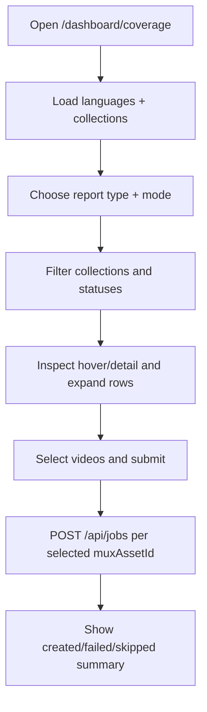

# feat: Restore legacy coverage report design and interaction parity

## Enhancement Summary
**Deepened on:** 2026-02-15  
**Sections enhanced:** 12  
**Research inputs used:** local skills (`architecture-strategist`, `security-sentinel`, `performance-oracle`, `frontend-design`, `design-implementation-reviewer`, `pattern-recognition-specialist`, `julik-frontend-races-reviewer`, `kieran-typescript-reviewer`, `code-simplicity-reviewer`, `repo-research-analyst`, `learnings-researcher`, `spec-flow-analyzer`), institutional learnings in `/videoforge/docs/solutions/`, and official framework docs via Context7 (`/vercel/next.js`, `/websites/react_dev`).

### Key Improvements
1. Added a route-shell strategy grounded in App Router layout/route-group behavior, including multiple-root-layout caveats.
2. Added race-safe React state management guidance for parity interactions (effects cleanup, key-based resets, and reducer boundaries).
3. Added phase-specific implementation details, edge cases, and measurable parity verification workflow for side-by-side QA.

### New Considerations Discovered
- Multiple root layouts in Next.js App Router can cause full page reloads between layout trees, so parity shell isolation should prefer a single root layout with route-targeted rendering decisions.
- Complex interactive parity behavior benefits from reducer-backed UI state slices and effect cleanup gates to avoid stale updates.

## Overview
Restore `/dashboard/coverage` to match the legacy `/videoforge/old-ai-media` coverage experience with:
- pixel-level visual parity
- interaction parity (explore/select, filters, hover detail, collection expansion, load-more behavior)
- standalone page shell behavior for coverage

Constraints:
- Keep current deterministic workflow and API contracts authoritative.
- Do not introduce new infrastructure/services.
- Keep external integration behind existing adapters and coverage route handlers.

## Problem Statement / Motivation
The migrated coverage screen is functionally correct but visually and behaviorally diverges from the legacy operator workflow. Current UI is card/table-based and generic, while legacy UI is a branded report surface with dense interaction patterns that operators rely on.

Current state (simplified UI):
- `/videoforge/src/app/dashboard/coverage/page.tsx:69`
- `/videoforge/src/features/coverage/coverage-report-client.tsx:332`
- `/videoforge/src/app/globals.css:122`

Legacy target state (reference):
- `/videoforge/old-ai-media/src/app/CoverageReportClient.tsx:1257`
- `/videoforge/old-ai-media/src/app/LanguageGeoSelector.tsx:162`
- `/videoforge/old-ai-media/src/app/globals.css:1`

## Research Summary

### Brainstorm Context Used
Found relevant brainstorm from 2026-02-15 and used it as planning input:
- `/videoforge/docs/brainstorms/2026-02-15-coverage-report-design-parity-brainstorm.md`

Locked decisions carried into this plan:
- Pixel + interaction parity target.
- Standalone shell on `/dashboard/coverage`.
- Rebuild parity in current architecture (not direct transplant).
- Deterministic workflow/API constraints override legacy UX when conflicts occur.
- Primary acceptance gate is side-by-side manual QA with `/videoforge/old-ai-media`.

### Repository Patterns (Local)
- Global dashboard header/nav is currently injected at root layout:
  - `/videoforge/src/app/layout.tsx:18`
- Coverage page currently renders inside generic container/card shell:
  - `/videoforge/src/app/dashboard/coverage/page.tsx:69`
- Existing coverage data/submit behavior is already deterministic and typed:
  - `/videoforge/src/features/coverage/coverage-report-client.tsx:266`
  - `/videoforge/src/features/coverage/submission.ts:53`
- Coverage gateway integration and normalization are isolated in adapter:
  - `/videoforge/src/services/coverage-gateway.ts:21`
  - `/videoforge/src/services/coverage-gateway.ts:298`

### Institutional Learnings (docs/solutions)
Relevant learnings to preserve while rebuilding UI:

1. Pending state + failure context must remain explicit and deterministic.
- File: `/videoforge/docs/solutions/logic-errors/pending-jobs-and-lost-step-context-video-enrichment-workflow-20260214.md`
- Key insight: keep failures observable, avoid implicit fallback behavior.

2. API error classification must keep client-vs-server boundaries clear.
- File: `/videoforge/docs/solutions/logic-errors/malformed-json-body-misclassified-as-500-jobs-api-20260215.md`
- Key insight: malformed client input remains 400; internal failures remain 500.

3. Adapter boundaries should fail predictably with actionable diagnostics.
- File: `/videoforge/docs/solutions/architecture/mux-ai-compatibility-gate-and-fallback-20260214.md`
- Key insight: deterministic failure beats silent fallback for operator correctness.

### Section Manifest and Skill Mapping
Section manifest used for deepening:
1. Shell isolation and route composition.
2. Coverage interaction architecture.
3. Pixel parity styling and asset strategy.
4. Stateful interaction/race hardening.
5. Verification and QA methodology.
6. Acceptance criteria and risk controls.

Skills mapped to sections:
- Shell composition and architectural boundaries:
  - `architecture-strategist`, `pattern-recognition-specialist`, `repo-research-analyst`
- UI/interaction parity design quality:
  - `frontend-design`, `design-implementation-reviewer`, `spec-flow-analyzer`
- Async/race/state correctness:
  - `julik-frontend-races-reviewer`, `kieran-typescript-reviewer`
- Reliability/security/performance guardrails:
  - `security-sentinel`, `performance-oracle`, `code-simplicity-reviewer`
- Institutional anti-regression context:
  - `learnings-researcher`

Agent discovery result:
- `.codex/agents` and `~/.codex/agents` did not contain runnable plan-review agent definitions in this environment.
- No plugin agent manifests were discoverable under `~/.codex/plugins/cache` in this environment.

### External Research Decision
Used targeted external framework research only (official sources) to harden layout/state decisions.
Reason:
- Legacy parity work changes shell composition and high-interaction client state behavior.
- These areas are sensitive to framework semantics in current Next.js/React versions.

Framework findings applied:
- Next.js App Router supports route groups and multiple root layouts, but navigation across different root layout trees triggers full page load; this affects shell strategy.
- React guidance for async effects recommends cleanup/ignore guards to avoid stale updates.
- React guidance recommends `key`-based resets for scoped state reset and `useReducer` when state transitions become complex.

## SpecFlow Analysis

### User Flow Overview
1. Operator opens `/dashboard/coverage`.
2. Page loads language + collection data from existing coverage adapter/routes.
3. Operator chooses report type and mode (explore/select).
4. Operator filters coverage globally and per-collection.
5. Operator inspects tiles/details via hover and expand/collapse.
6. Operator selects videos and triggers translation/order flow.
7. System submits one job per selected selectable video and shows deterministic summary.



### Flow Permutations Matrix
1. User state
- First visit: default language/report/mode selection.
- Returning visit: session-restored mode/report behavior.

2. Data state
- Gateway configured and returns full mappings.
- Gateway configured with partial/no muxAssetId mappings.
- Gateway unavailable or returns errors.

3. Interaction state
- Explore mode (view/filter/inspect only).
- Select mode (tile/collection/status-level selection).
- Expanded collection detail rows vs collapsed tile matrix.

4. Submit outcomes
- All created.
- Mixed created/failed/skipped.
- Fully failed with actionable error details.

### Missing Elements & Gaps To Resolve
- Standalone shell behavior is not currently possible with root header always present:
  - `/videoforge/src/app/layout.tsx:18`
- Current coverage UI lacks legacy interaction structures:
  - mode toggle, translation action bar, per-collection bars, hover detail pane, tile matrix.
- Current styling is global and generic in app stylesheet:
  - `/videoforge/src/app/globals.css:122`
- Legacy assets/background/logo are not available in current app public assets.
- No explicit parity checklist exists for side-by-side sign-off.

### Critical Clarifications (Resolved)
- Parity target: pixel + interaction.
- Shell target: standalone on coverage page.
- Conflict precedence: deterministic workflow/API correctness first.
- Acceptance gate: side-by-side manual QA.

## Proposed Solution
Rebuild legacy coverage visual and interactive behavior inside current feature boundaries:
- Keep current data adapter and submission logic contracts.
- Replace generic table UI with parity-focused coverage report composition.
- Isolate parity styling/assets so other dashboard routes are unaffected.
- Add regression tests for parity-critical behaviors and shell behavior.

## Technical Approach

### Phase 1: Shell and Route Composition
Goal: make `/dashboard/coverage` render with standalone shell semantics while preserving jobs/dashboard routes.

Tasks:
- [x] Extract global header/nav from `/videoforge/src/app/layout.tsx` into `/videoforge/src/app/_components/global-header.tsx` (client-aware visibility control).
- [x] Add route-aware header visibility rule so `/dashboard/coverage` renders without platform header.
- [x] Update `/videoforge/src/app/dashboard/coverage/page.tsx` root markup to parity-compatible shell container (not generic `container grid` wrapper).
- [x] Add shell regression test for route-based header visibility (implemented in `/videoforge/tests/global-shell.test.ts`).

Deliverables:
- Standalone coverage shell behavior.
- No regressions for `/dashboard/jobs` shell.

#### Research Insights
**Best practices:**
- Keep one root layout tree when possible; isolate shell behavior with route-level branching or nested layouts to avoid unintended full-page reload behavior.
- Prefer explicit shell ownership for `/dashboard/coverage` rather than styling hacks that hide shared headers.

**Implementation details:**
```tsx
// /videoforge/src/app/layout.tsx (concept)
// Keep single root layout and conditionally render global header by pathname segment.
// Do not create separate root layout trees unless full reload behavior is acceptable.
```

**Edge cases:**
- Client navigation from `/dashboard/jobs` to `/dashboard/coverage` must remain smooth and not regress to full-page reload due to root layout split.
- SSR markup for coverage route must not include hidden-but-rendered header nodes that break parity or accessibility.

**References:**
- Next.js layout conventions and multiple root layout caveats (official docs).
- Next.js route groups caveats (official docs).

### Phase 2: Coverage UI Component Parity Rebuild
Goal: replace generic coverage table UI with legacy-equivalent composition in current architecture.

Tasks:
- [x] Refactor `/videoforge/src/features/coverage/coverage-report-client.tsx` into parity-oriented sections:
  - report header block with brand + report selector + aggregate coverage bar
  - mode panel with explore/select controls
  - translation action bar (selection summary + scope + actions)
  - collection card system with tile matrix and detail rows
- [ ] Add feature-local subcomponents under `/videoforge/src/features/coverage/components/`:
  - `coverage-bar.tsx`
  - `report-type-selector.tsx`
  - `mode-toggle.tsx`
  - `translation-action-bar.tsx`
  - `collection-card.tsx`
  - `meta-summary.tsx`
- [x] Rebuild geo language selector behavior from legacy patterns in `/videoforge/src/features/coverage/components/language-geo-selector.tsx`, using existing API route contracts.
- [x] Preserve deterministic submit path by reusing `/videoforge/src/features/coverage/submission.ts`.

Deliverables:
- Functional parity with legacy interaction model.
- Existing deterministic submit behavior unchanged in contract.

#### Research Insights
**Best practices:**
- Split parity UI into focused, testable subcomponents while retaining a single orchestration component for shared state.
- Keep discriminated unions and explicit props contracts for selectable vs non-selectable video items.
- Keep event handling declarative and avoid implicit DOM coupling in tile and detail interactions.

**Implementation details:**
```ts
// /videoforge/src/features/coverage/types.ts (concept)
// Preserve discriminated unions for interaction gates:
// type CoverageVideo = CoverageVideoSelectable | CoverageVideoUnmappable;
```

```tsx
// /videoforge/src/features/coverage/components/collection-card.tsx (concept)
// Keep collection-level selection/filter logic local, pass only stable callbacks from parent.
```

**Edge cases:**
- Report-type switches while collections are expanded should preserve/clear expansion state intentionally (define deterministic rule).
- Items with missing `watchUrl` or `thumbnailUrl` should preserve parity affordances without breaking layout.

### Phase 3: Pixel Parity Styling and Assets
Goal: achieve visual parity without global style regressions.

Tasks:
- [ ] Move coverage-specific styles out of `/videoforge/src/app/globals.css` into `/videoforge/src/features/coverage/coverage-report.css` (or module equivalent) and import only from coverage entry.
- [x] Port legacy style tokens/layout rules from `/videoforge/old-ai-media/src/app/globals.css` into namespaced selectors rooted under coverage container.
- [x] Add parity assets into `/videoforge/public/`:
  - `World_map_with_points.svg`
  - `jesusfilm-sign.svg`
- [ ] Ensure mobile and desktop breakpoint behavior aligns with legacy visual structure.

Deliverables:
- Pixel-focused parity layer isolated to coverage feature.
- No unintended style leakage to jobs/dashboard routes.

#### Research Insights
**Best practices:**
- Migrate parity styles into a feature-scoped stylesheet imported only by coverage entry components.
- Keep one high-specificity feature root class and avoid redefining global element selectors (`body`, `main`, `code`) for parity.
- Preserve tokenized color and spacing values so visual diffs can be tuned predictably.

**Implementation details:**
```css
/* /videoforge/src/features/coverage/coverage-report.css (concept) */
.coverage-report-root { /* parity root namespace */ }
.coverage-report-root .report-header { /* legacy-equivalent block styling */ }
```

**Edge cases:**
- Background map overlay must not interfere with click/touch hit testing (`pointer-events: none`).
- Asset delivery fallback should degrade gracefully if public asset paths are unavailable in dev.

### Phase 4: Interaction Parity Hardening
Goal: lock in parity-critical behavior where legacy and current diverged.

Tasks:
- [x] Implement session-backed mode/report persistence equivalents (legacy behavior) inside `/videoforge/src/features/coverage/coverage-report-client.tsx`.
- [x] Implement collection-level filters and selection-by-status actions in `/videoforge/src/features/coverage/components/collection-card.tsx`.
- [x] Implement hover detail card behavior and expanded/collapsed collection interaction.
- [x] Keep submit lock and retry behavior deterministic:
  - `/videoforge/src/features/coverage/coverage-report-client.tsx:266`
  - `/videoforge/src/features/coverage/submission.ts:53`
- [ ] Explicitly document and test any intentional deviations required by deterministic backend constraints.

Deliverables:
- Interaction parity with legacy behavior where compatible.
- Deterministic safeguards preserved.

#### Research Insights
**Best practices:**
- Guard async fetch effects with cleanup/ignore logic to prevent stale state writes.
- Use `key`-based reset boundaries for scoped UI state that should fully reset on language/report changes.
- Move complex interaction transitions (mode + selection + expansion + hover detail) into reducer-managed state once conditionals exceed simple `useState` readability.

**Implementation details:**
```ts
// React effect cleanup pattern (concept)
useEffect(() => {
  let ignore = false;
  runAsync().then((next) => {
    if (!ignore) setState(next);
  });
  return () => {
    ignore = true;
  };
}, [deps]);
```

**Edge cases:**
- Rapid language toggles during in-flight fetches must not backfill stale collection payloads.
- Hover detail state should clear on collection collapse and on mode switch to avoid stale “selected detail” panels.

### Phase 5: Verification and Regression Coverage
Goal: verify parity and guard against regressions.

Tasks:
- [ ] Expand feature behavior tests in `/videoforge/tests/dashboard-coverage-page.test.tsx`:
  - mode toggle rendering/behavior
  - filter and empty-state behavior
  - standalone shell rendering
- [ ] Add/expand logic tests in `/videoforge/tests/coverage-submission.test.ts` for deterministic submit behavior after UI refactor.
- [x] Keep coverage API tests green in `/videoforge/tests/api-coverage-routes.test.ts`.
- [x] Re-run jobs API contract tests in `/videoforge/tests/api-jobs-contract.test.ts` to ensure UI refactor does not alter API assumptions.
- [ ] Run manual side-by-side QA against `/videoforge/old-ai-media` at:
  - desktop wide
  - desktop narrow
  - mobile viewport
- [ ] Record parity checklist outcomes directly in this plan file before implementation close.

Deliverables:
- Automated regression confidence.
- Manual parity sign-off evidence.

#### Research Insights
**Best practices:**
- Treat parity verification as two independent gates: behavior correctness (tests) and visual fidelity (manual side-by-side checklist).
- Keep deterministic contracts under test while UI evolves (coverage routes, submit flow, jobs API semantics).

**Implementation details:**
```bash
# Recommended verification order
pnpm typecheck
pnpm test tests/api-coverage-routes.test.ts
pnpm test tests/coverage-submission.test.ts
pnpm test tests/dashboard-coverage-page.test.tsx
pnpm test tests/api-jobs-contract.test.ts
```

**Edge cases:**
- Ensure SSR test assertions remain resilient after shell refactor (header visibility expectations split by route).
- Preserve malformed JSON 400 behavior on `/api/jobs` while testing parity-driven submit changes.

## Acceptance Criteria

### Functional Requirements
- [x] `/dashboard/coverage` renders as standalone shell (no platform header block).
- [ ] Coverage page matches legacy report structure (header, selectors, bars, tiles, detail rows, action bars).
- [ ] Explore/select mode interactions match legacy behavior.
- [x] Selection, submission, retry, and summary flows remain deterministic and preserve current API contracts.
- [x] Existing coverage API behavior and env fallback rules remain unchanged.

### Non-Functional Requirements
- [ ] Styling is isolated to coverage feature and does not regress `/dashboard/jobs`.
- [x] No new infrastructure/services/dependencies are introduced.
- [x] Test suite remains Codex Cloud compatible (no bound ports, no external network dependency).
- [ ] Any parity deviation is explicitly documented with deterministic constraint rationale.
- [x] Coverage shell isolation does not introduce multi-root-layout navigation reload regressions.

### Quality Gates
- [x] `pnpm typecheck`
- [x] `pnpm test tests/dashboard-coverage-page.test.tsx`
- [x] `pnpm test tests/coverage-submission.test.ts`
- [x] `pnpm test tests/api-coverage-routes.test.ts`
- [x] `pnpm test tests/api-jobs-contract.test.ts`
- [ ] Manual side-by-side parity checklist completed and reviewed.
- [ ] Route navigation sanity check: `/dashboard/jobs` -> `/dashboard/coverage` -> `/dashboard/jobs`.

## Side-by-Side Parity Checklist

### Visual
- [ ] Typography family/size/weight alignment.
- [ ] Global/background treatment (map overlay, surface contrast).
- [ ] Header composition (brand mark, selectors, aggregate bar).
- [ ] Collection card spacing, borders, dividers, controls.
- [ ] Tile color/status mapping for human/ai/none.

### Interaction
- [ ] Report type changes update bars/labels and collection statuses.
- [ ] Explore/select toggle behavior matches legacy gating.
- [ ] Collection expand/collapse and detail row behavior matches legacy.
- [ ] Hover interactions show correct detail panel content.
- [ ] Load-more behavior and progress affordances match legacy intent.

### Deterministic Constraints
- [x] Missing `muxAssetId` items remain non-selectable with explicit reason.
- [x] Submit lock prevents duplicate in-flight submissions.
- [x] Batch summary remains ordered and stable.
- [x] Error messaging remains explicit and contract-safe.

## Dependencies & Risks

### Dependencies
- Existing coverage gateway routes and adapter:
  - `/videoforge/src/app/api/coverage/languages/route.ts`
  - `/videoforge/src/app/api/coverage/collections/route.ts`
  - `/videoforge/src/services/coverage-gateway.ts`
- Existing deterministic submission pipeline:
  - `/videoforge/src/features/coverage/submission.ts`

### Risks
1. Route shell refactor accidentally affects non-coverage pages.
- Mitigation: header visibility tests for both coverage and jobs pages.

2. CSS parity work leaks into global styles.
- Mitigation: feature-root namespacing and moving coverage styles out of global stylesheet.

3. Interaction parity introduces race/state regressions.
- Mitigation: preserve abort/lock patterns and expand deterministic tests.

4. Legacy parity conflicts with current contract behavior.
- Mitigation: contract-first rule; document deviations explicitly.

## Alternative Approaches Considered

### Option A: Direct legacy transplant
- Pros: quickest to visual parity.
- Cons: imports legacy structure/debt and increases long-term maintenance risk.

### Option B: Rebuild parity in current architecture (Chosen)
- Pros: best maintainability while still meeting parity target.
- Cons: more careful implementation required to avoid drift.

### Option C: Two-phase parity (visual then interaction)
- Pros: lower immediate delivery risk.
- Cons: delayed true parity and prolonged operator mismatch.

## References & Research

### Internal References
- Brainstorm source:
  - `/videoforge/docs/brainstorms/2026-02-15-coverage-report-design-parity-brainstorm.md`
- Current coverage page:
  - `/videoforge/src/app/dashboard/coverage/page.tsx:25`
- Current global shell:
  - `/videoforge/src/app/layout.tsx:18`
- Current coverage client:
  - `/videoforge/src/features/coverage/coverage-report-client.tsx:71`
- Legacy coverage client target:
  - `/videoforge/old-ai-media/src/app/CoverageReportClient.tsx:1257`
- Legacy geo selector target:
  - `/videoforge/old-ai-media/src/app/LanguageGeoSelector.tsx:162`
- Legacy style target:
  - `/videoforge/old-ai-media/src/app/globals.css:1`

### Existing Test Baseline
- `/videoforge/tests/dashboard-coverage-page.test.tsx:13`
- `/videoforge/tests/coverage-submission.test.ts:68`
- `/videoforge/tests/api-coverage-routes.test.ts:14`
- `/videoforge/tests/api-jobs-contract.test.ts:59`

### Framework References (Official)
- Next.js App Router layouts and root layout behavior:
  - https://nextjs.org/docs/app/api-reference/file-conventions/layout
- Next.js route groups and caveats:
  - https://nextjs.org/docs/app/api-reference/file-conventions/route-groups
- React effect synchronization and cleanup:
  - https://react.dev/learn/synchronizing-with-effects
- React guidance on avoiding unnecessary effects and key-based resets:
  - https://react.dev/learn/you-might-not-need-an-effect
- React reducer guidance for complex state transitions:
  - https://react.dev/learn/extracting-state-logic-into-a-reducer

### Institutional Learnings
- `/videoforge/docs/solutions/logic-errors/pending-jobs-and-lost-step-context-video-enrichment-workflow-20260214.md`
- `/videoforge/docs/solutions/logic-errors/malformed-json-body-misclassified-as-500-jobs-api-20260215.md`
- `/videoforge/docs/solutions/architecture/mux-ai-compatibility-gate-and-fallback-20260214.md`

## Definition of Done
- Coverage page is visually and behaviorally parity-verified against legacy references.
- Deterministic job submission and API contract behavior remain intact.
- Automated tests for coverage behavior and related contracts pass.
- No cross-page style regressions are observed.
- PRD/plan notes are updated with any justified parity deviations.
